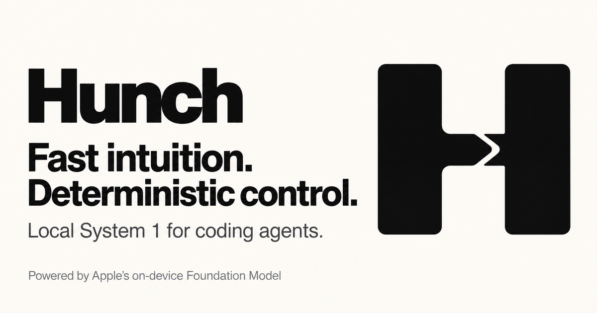

<p align="center">
  
</p>

# Hunch

**Fast intuition. Deterministic control.**

Hunch is a local System 1 layer for coding agents, powered by Apple's on-device Foundation Model. It asks small, typed questions about a task—intent, scope, risk—and lets deterministic policy code decide what an agent may do next.

The model labels; code decides.

Hunch takes its question format from TypeSafe's [Jev](https://typesafe.ai) and ideas from two open System 1 models, [Laya](https://github.com/receptron/laya) and Fastino's [GLiNER2](https://github.com/fastino-ai/GLiNER2). The goal is Jev's request and response shape, so code written for Jev can run against Hunch, and back, without changes. That API is designed, not yet built in Swift; see the [design doc](hunch-docs/architecture.md).



## Status

**Early prototype.** The current Swift package provides a local risk classifier and a CLI. The policy engine, resident daemon, generation commands, and integrations with Claude Code, Codex, OpenCode, and Cursor are planned. `hunchd` is currently a placeholder.

## How it works

The intended flow is:

1. An agent or CLI submits a task and relevant context.
2. Apple's on-device model answers typed questions about that task.
3. Deterministic rules choose a route: answer locally, gather evidence, hand off to a frontier model, or ask a human.

Hunch keeps small judgments local while reserving larger models for work that needs them. Model output informs policy; it does not authorize actions on its own.

## Beyond classification

The same local generative model can also help prepare work for a coding agent. Planned capabilities include summarizing logs and diffs, packing context for a frontier model, and drafting commit messages or PR descriptions. These extend Hunch beyond typed classification into local generation.

## Requirements

- macOS 27 or later with Apple Intelligence enabled
- Xcode 27 / Swift 6.2 or later

## Quick start

```bash
swift build
swift run hunch "delete all git branches"
swift test
```

The CLI prints one risk label: `readOnly`, `reversibleWrite`, `destructive`, or `sensitive`. It classifies the supplied text; it does not execute the task. If the on-device model is unavailable, the command reports an error.

## Project layout

- [`Sources/HunchCore`](Sources/HunchCore): shared typed risk classifier using FoundationModels.
- [`Sources/hunch`](Sources/hunch): command-line entry point.
- [`Sources/hunchd`](Sources/hunchd): placeholder for the resident daemon.
- [`hunch-docs/architecture.md`](hunch-docs/architecture.md): design notes and roadmap.

## Brand assets

[SVG logo](output/imagegen/hunch-logo.svg) · [PNG logo](output/imagegen/hunch-logo.png) · [WebP logo](output/imagegen/hunch-logo.webp)

[Social image, PNG](output/imagegen/hunch-social.png) · [Social image, WebP](output/imagegen/hunch-social.webp) — 1200 × 630.

## License

Apache License 2.0. See [LICENSE](LICENSE).
